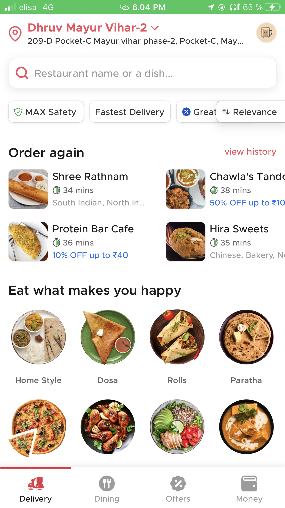
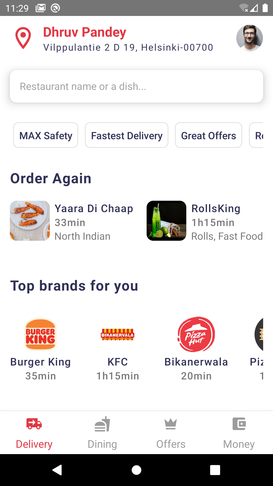
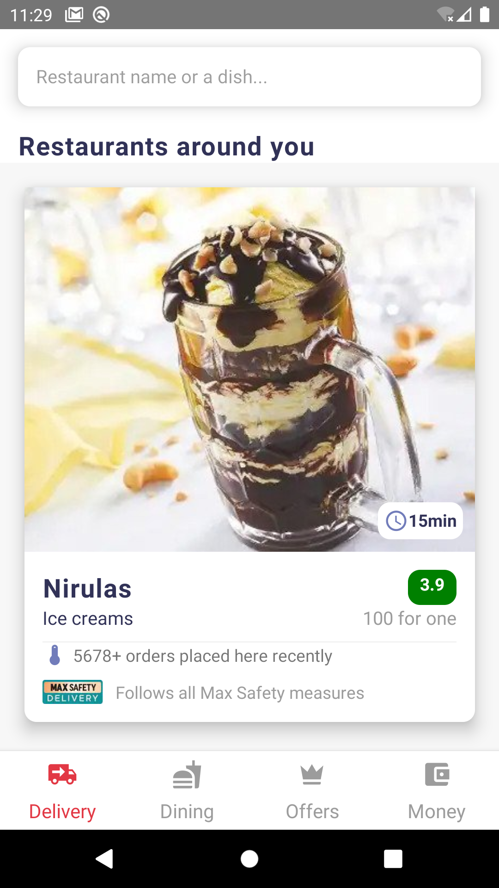
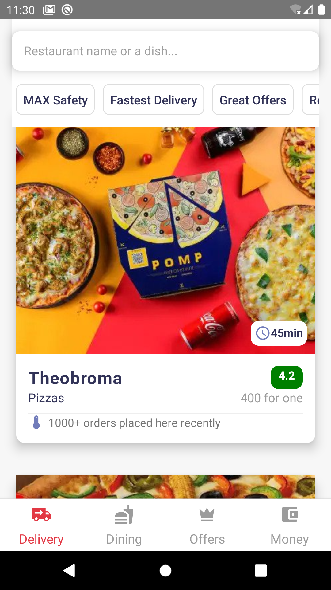

Inspired from Zomato. Just for learning purpose. No intent for commercial use.

<h2>Original Zomato App</h2>

<h2>Cloned App</h2>

Reference for assets
=====================================================
https://www.zomato.com/ncr/delivery-in-mayur-vihar-phase-2

Folder structure best practise
======================================================
https://www.youtube.com/watch?v=ccOtKD5ZL1E

Git steps
====================================================
git init -b main git remote add origin https://github.com/pdhruv93/zomato-clone.git git add . && git commit -m "initial commit" && git push git push origin main
